# Airway — Airline Reservation System

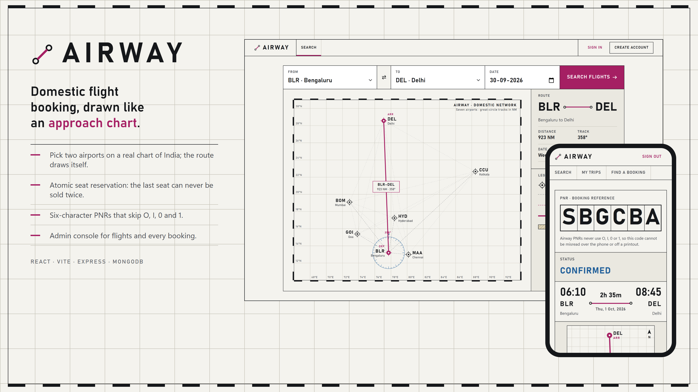

**Airway** is a web-based airline reservation system for domestic flights between seven Indian
airports. It was built as a fifth-semester Software Engineering & Project Management course project
at Dayananda Sagar University. The team of 10 follows the **Waterfall model**; the SRS and SDD are
approved and frozen, and the implementation follows that approved design.

Passengers pick a route on a chart of India, book a seat, and get a six-character PNR. Admins manage
the schedule and see every booking. The frontend is styled like an aeronautical approach chart.

The project runs **locally only** — there is no deployment.

---

## Screenshots

| | |
|---|---|
| 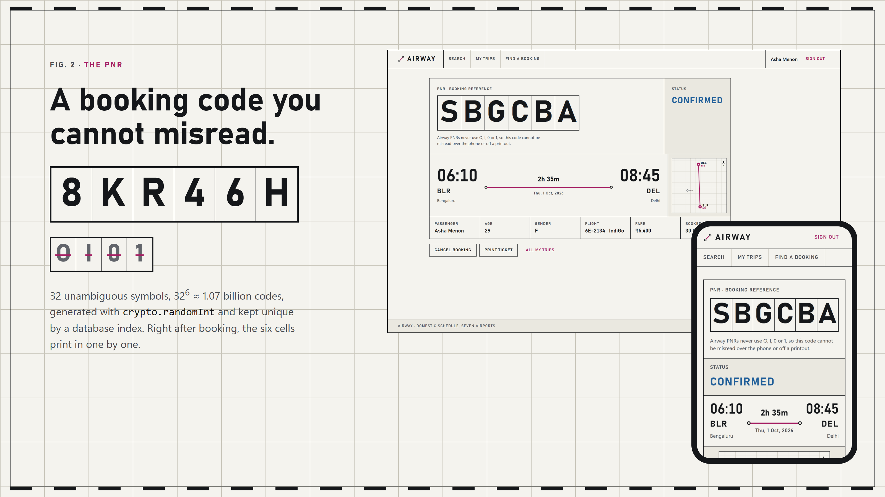 | 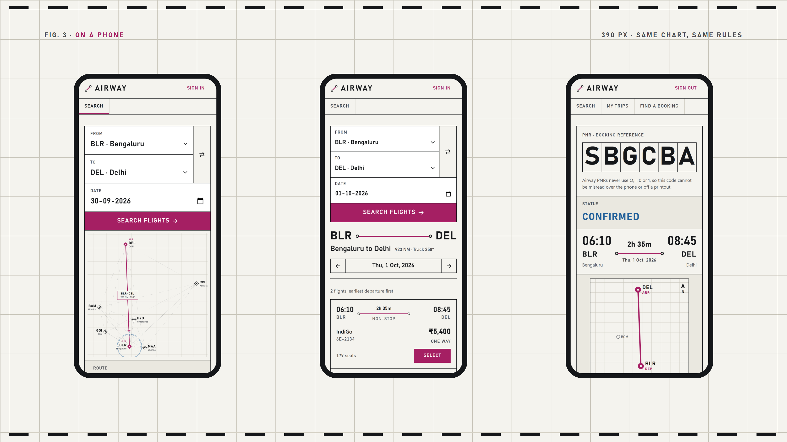 |
| **The PNR.** Six ruled cells, no O, I, 0 or 1, printed in cell by cell after booking. | **On a phone.** The same chart, results and ticket at 390 px. |

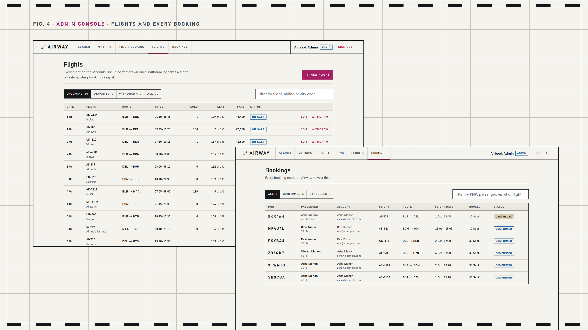

<details>
<summary>More screens</summary>

| Search results | Sold-out flight |
|---|---|
| 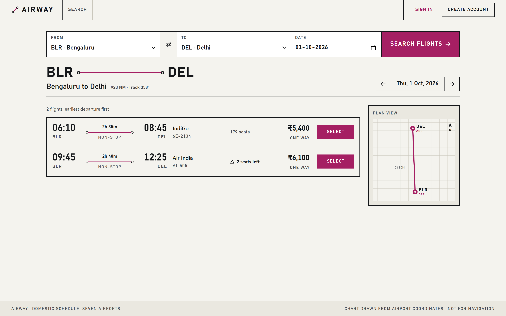 | 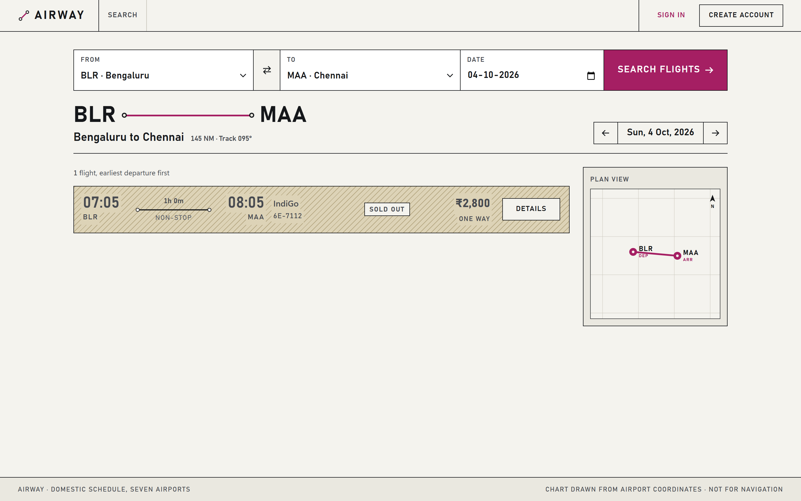 |

| Flight page and booking form | Ticket |
|---|---|
| 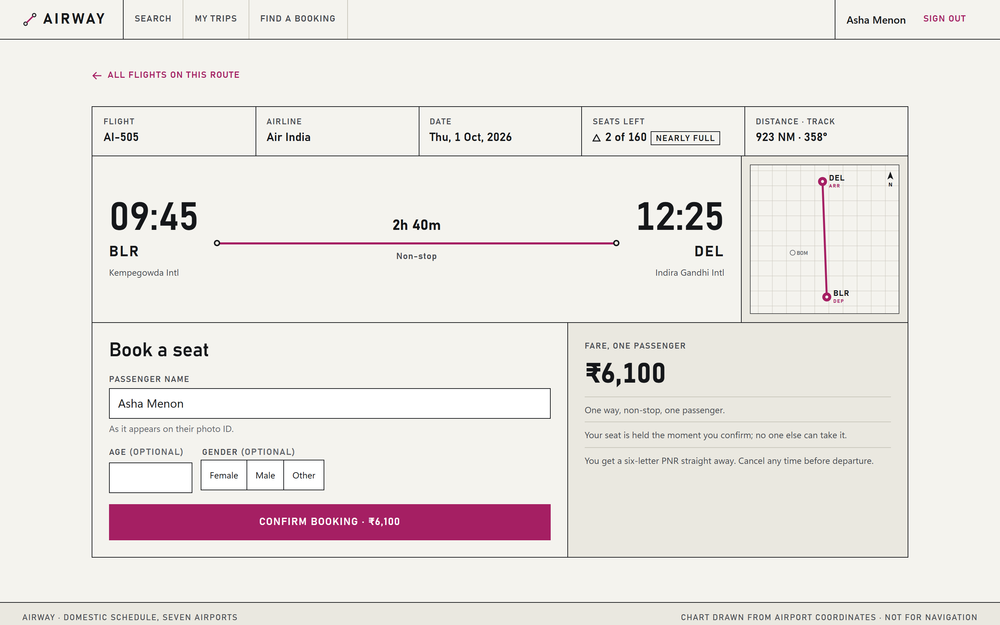 | 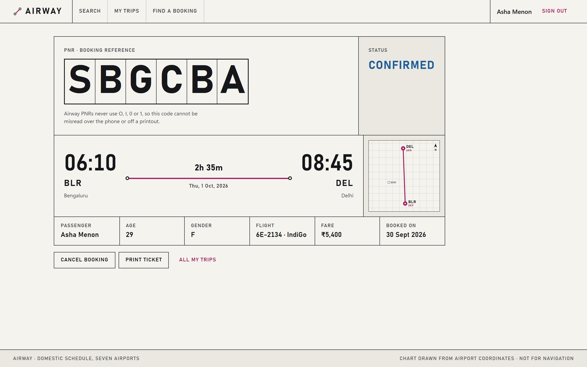 |

| Cancelled ticket | My trips |
|---|---|
| 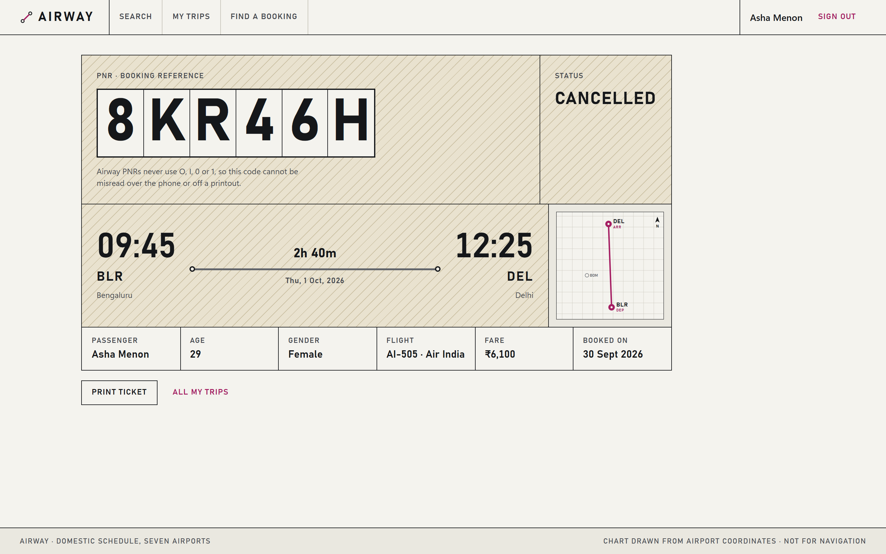 | 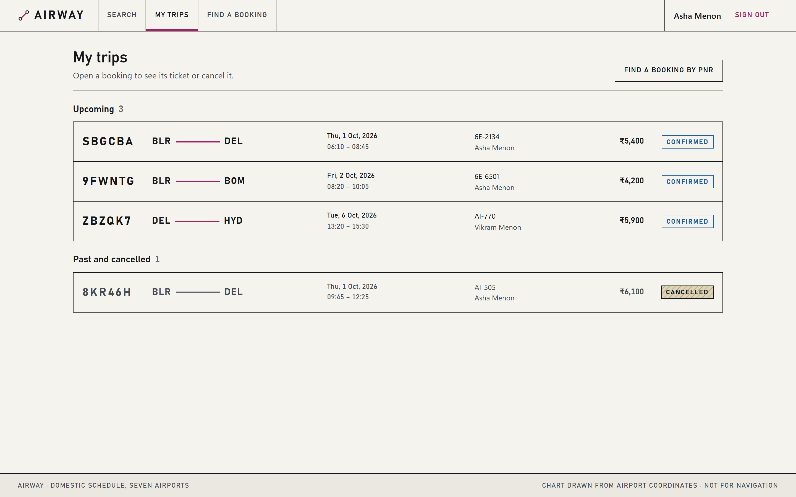 |

| Admin: flights | Admin: bookings |
|---|---|
| 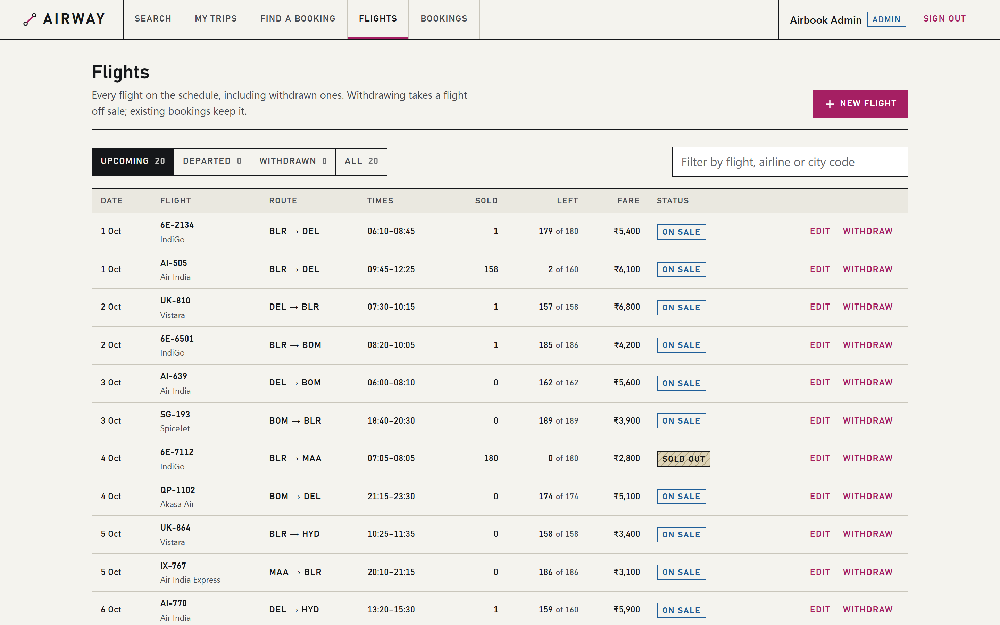 | 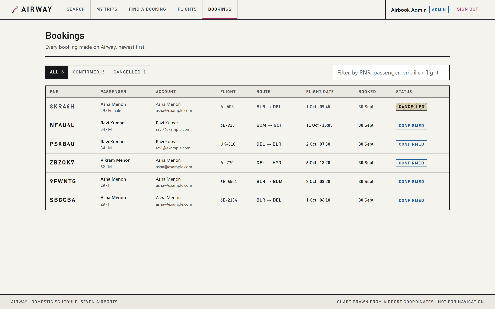 |

</details>

---

## Quick start

You need Node.js 20 or newer and MongoDB (local, or an Atlas connection string).

```bash
# Terminal 1: backend on http://localhost:5000
cd backend
npm install
cp .env.example .env      # then fill in MONGO_URI and JWT_SECRET
npm run seed              # wipes the database and loads demo data
npm start

# Terminal 2: frontend on http://localhost:5173
cd frontend
npm install
npm run dev
```

Open <http://localhost:5173> and sign in with one of the [demo accounts](#loading-demo-data).

---

## Repository layout

```
Airline-System/
├── backend/          Node.js + Express + MongoDB REST API
├── frontend/         React + Vite web app ("Airway")
├── docs/screenshots/ Images used in this README
├── PRODUCT.md        Who the app is for, its purpose and constraints
├── DESIGN.md         The visual design system: colours, type, spacing, rules
└── API-CHANGELOG.md  Dated record of any approved change to the API contract
```

---

## Backend

### Stack

- Node.js 20 LTS (CommonJS modules)
- Express.js
- MongoDB with Mongoose
- `jsonwebtoken` for auth, `bcryptjs` for password hashing

### Prerequisites

- Node.js 20 or newer
- MongoDB running locally, or a MongoDB Atlas connection string

### Setup

```bash
cd backend
npm install
cp .env.example .env
```

Then open `.env` and fill in the values:

| Variable | What it is |
|---|---|
| `PORT` | Port Express listens on. Default `5000`. |
| `MONGO_URI` | MongoDB connection string, local or Atlas. **Required.** |
| `JWT_SECRET` | Any long random string. Used to sign login tokens. **Required.** |
| `CLIENT_URL` | Origin allowed by CORS. `http://localhost:5173` for Vite's dev server. |

`.env` is gitignored and must never be committed.

The server refuses to start if `MONGO_URI` or `JWT_SECRET` is missing, and says which one. Without
that check a missing `JWT_SECRET` would let the server start, let registration succeed, and then
fail every login with an unexplained 500.

### Running

```bash
npm start     # start the server
npm run dev   # start with auto-restart on file changes
npm run seed  # wipe the database and load demo data
```

### Loading demo data

`npm run seed` wipes the database and inserts 3 users, 20 flights and 5 bookings, then prints the
logins and a few things worth demonstrating. Flights are spread over the next 14 days across BLR,
DEL, BOM, MAA, HYD, CCU and GOI on six real airlines.

| Account | Password | Role |
|---|---|---|
| `admin@airbook.com` | `Admin@123` | admin |
| `asha@example.com` | `Test@123` | passenger, 3 bookings |
| `ravi@example.com` | `Test@123` | passenger, 2 bookings |

The seed deliberately includes one flight with **0 seats left** and two that are nearly full, so the
sold-out path can be shown without making 180 bookings by hand. Those three flights have no
`Booking` documents behind their missing seats — they represent seats sold before this system
existed. Every other flight keeps `available_seats + confirmed bookings === total_seats`.

### Verifying it works

```bash
curl http://localhost:5000/api/health
```

Expected response: `{ "status": "ok" }`

---

## Frontend

### Stack

- React 19 with React Router 7
- Vite 8 (dev server and build)
- Plain CSS with design tokens in `src/styles/tokens.css`; no UI or CSS libraries
- The route chart and plan views are hand-drawn SVG built from real airport coordinates

### Setup and running

```bash
cd frontend
npm install
npm run dev       # dev server on http://localhost:5173
npm run build     # production build into dist/
npm run preview   # serve the production build locally
```

The backend must be running on port 5000. To point the app at a different API, create
`frontend/.env.local` (gitignored) with:

```
VITE_API_URL=http://localhost:5000/api
```

Vite is pinned to port **5173** (`strictPort`). If that port is busy it fails with an error instead
of moving to 5174, because the backend's CORS setting (`CLIENT_URL`) only allows 5173 and a silent
port change would surface as a confusing CORS error.

### Screens

| Path | Screen | Access |
|---|---|---|
| `/` | Search: pick From/To on the chart (or the boxes), and the route draws itself | anyone |
| `/flights?from=&to=&date=` | Results for one route and day, with previous/next day | anyone |
| `/flights/:id` | Flight page: facts, plan view, fare and the booking form | anyone (booking needs sign-in) |
| `/login`, `/register` | Sign in and create an account | anyone |
| `/bookings/:pnr` | Ticket: PNR, status, route, print and cancel | signed in, own bookings |
| `/trips` | My trips: upcoming, past and cancelled | signed in |
| `/find` | Find a booking by PNR | signed in |
| `/admin/flights` | All flights with Upcoming / Departed / Withdrawn / All filters; withdraw and reinstate | admin |
| `/admin/flights/new`, `/admin/flights/:id/edit` | Create or edit a flight | admin |
| `/admin/bookings` | Every booking, filterable by PNR, passenger, email or flight | admin |

### How it is organised

```
frontend/src/
├── main.jsx, App.jsx   Router, auth provider and the route table
├── lib/                api.js (the only place that calls the backend), auth.jsx,
│                       cities.js (the seven airports), format.js, lastSearch.js
├── components/         Shell, BriefingStrip (search form), RouteChart, RouteInset,
│                       FlightRow, PnrMark
├── pages/              One file per screen; admin screens in pages/admin/
└── styles/             tokens.css first, then base, shell and one file per area
```

### Things the frontend does on purpose

- **Every backend error has a screen.** `api.js` turns `{ error: { code, message } }` into an
  `ApiError`. Pages branch on the code: `NO_SEATS_AVAILABLE` says the last seat has just gone and
  refreshes the seat count, `FLIGHT_IN_PAST` and `FLIGHT_INACTIVE` explain why booking is closed, and
  `INVALID_TOKEN` signs the user out and says the 24-hour session ended.
- **Unavailable means hatched, not red.** Sold-out, departed, withdrawn and cancelled items use the
  chart's terrain hatching. Magenta is kept for the chosen route and for actions.
- **Times are never formatted in the browser.** Every time on screen is `departure_time_display`,
  `arrival_time_display` or `duration_display` from the API. Only prices and dates are formatted.
- **Dates are read in UTC**, matching how the backend stores `flight_date`.
- **"Departed" labels use the backend's own rule** (flight date at midnight UTC plus departure
  minutes), so a row never shows as bookable when the backend would refuse it.
- **The last search is remembered** in `localStorage` and offered again on the search page.
- **Distance and track** on the chart are great-circle geometry calculated from the airport
  coordinates in `cities.js`. They are not flight data.

### Design

The visual system (chart-paper background, black ink, 1px ruled boxes, square corners, one magenta
accent, terrain hatching) is documented in [DESIGN.md](DESIGN.md), with the product brief in
[PRODUCT.md](PRODUCT.md). Chart lettering uses Bahnschrift, which ships with Windows. On macOS or
Linux it falls back to a similar narrow sans-serif, because no font files are bundled.

---

## API reference

Base URL `http://localhost:5000/api`. All request and response bodies are JSON.

Authenticated endpoints expect the login token in a header:

```
Authorization: Bearer <token>
```

### Response shapes — read this first

The API is **not** uniform about wrapping, and this is deliberate — it follows the frozen API contract
from the approved SDD literally:

- Endpoints that return **a list** return a **bare array**: `[ {...}, {...} ]`
- Endpoints that return **one object** return it **wrapped under a key**: `{ "flight": {...} }` or
  `{ "booking": {...} }`

So `GET /flights/search` gives you an array you can map over directly, while `GET /flights/:id`
gives you an object whose `flight` property holds the flight. Check the table below rather than
assuming.

### Auth

| Method | Path | Body | Success | Auth |
|---|---|---|---|---|
| POST | `/auth/register` | `{name, email, password, phone?}` | `201 {"message": "..."}` | none |
| POST | `/auth/login` | `{email, password}` | `200 {"token": "...", "user": {id, name, email, role}}` | none |

The token expires after 24 hours and carries only `{id, role}`. `password_hash` is never returned by
any endpoint.

### Flights

| Method | Path | Success | Auth |
|---|---|---|---|
| GET | `/flights` | `200 [flight, ...]` every flight, including inactive | admin |
| GET | `/flights/search?from=&to=&date=` | `200 [flight, ...]` | none |
| GET | `/flights/:id` | `200 {"flight": {...}}` | none |
| POST | `/flights` | `201 {"flight": {...}}` | admin |
| PUT | `/flights/:id` | `200 {"flight": {...}}` | admin |
| DELETE | `/flights/:id` | `200 {"message": "..."}` | admin |

Search notes:

- `from` and `to` are city codes and are matched case-insensitively (`blr` works); `date` is
  `YYYY-MM-DD`. All three are required.
- Results are **sorted by departure time** and **exclude soft-deleted flights**.
- Results **include sold-out flights** with `available_seats: 0`. Render a sold-out state rather
  than assuming every result can be booked.
- `GET /flights/:id` **does** return soft-deleted flights, so a passenger can still open the flight
  attached to an older booking.

Create and update notes:

- `available_seats` defaults to `total_seats` on create and **cannot be set directly** on update. It
  is derived: booking and cancellation move it, and changing `total_seats` moves it by the same
  amount.
- Reducing `total_seats` below the number of confirmed bookings is refused with `409`.
- `DELETE` is a **soft delete** (`is_active: false`). The document is never removed, because MongoDB
  has no foreign keys and a hard delete would orphan every booking pointing at that flight.

### Bookings

| Method | Path | Body | Success | Auth |
|---|---|---|---|---|
| POST | `/bookings` | `{flight_id, passenger_name, passenger_age?, passenger_gender?}` | `201 {"booking": {...}}` | logged in |
| GET | `/bookings/my` | — | `200 [booking, ...]` flight populated | logged in |
| GET | `/bookings/pnr/:pnr` | — | `200 {"booking": {...}}` | own booking only |
| PUT | `/bookings/cancel/:id` | — | `200 {"booking": {...}}` | own booking only |
| GET | `/bookings/all` | — | `200 [booking, ...]` user + flight populated | admin |

Population differs per endpoint, again following the contract:

- `/bookings/my` — `flight_id` is the **full flight object**, newest booking first.
- `/bookings/all` — both `user_id` and `flight_id` are **full objects**.
- `POST /bookings`, `/bookings/pnr/:pnr` and `cancel` — `flight_id` is just the **id string**. Fetch
  `GET /flights/:id` if the screen needs flight details.

PNR lookup is case-insensitive, and only ever finds the caller's own booking.

### Every flight object carries display fields

Any flight the API returns — standalone or populated inside a booking — includes three derived
fields alongside the raw values, so no screen has to format times itself:

```json
{
  "flight_number": "6E-2134",
  "departure_city": "BLR",
  "arrival_city": "DEL",
  "departure_time": 370,
  "arrival_time": 525,
  "departure_time_display": "06:10",
  "arrival_time_display": "08:45",
  "duration_display": "2h 35m",
  "available_seats": 179,
  "price": 5400
}
```

Times are stored as **minutes since midnight** because `"10:30 AM"` cannot be sorted or subtracted.
Overnight flights are handled: a flight departing 22:30 and landing 00:45 reports `2h 15m`, not a
negative duration.

### Errors

Every error response, without exception, uses this shape:

```json
{ "error": { "code": "NO_SEATS_AVAILABLE", "message": "This flight is fully booked." } }
```

| Status | Code | When |
|---|---|---|
| 400 | `VALIDATION_ERROR` | Missing, blank, or wrongly typed input |
| 400 | `INVALID_ID` | The id in the URL is not a valid ObjectId |
| 400 | `INVALID_JSON` | The request body could not be parsed |
| 401 | `NO_TOKEN` | No `Authorization` header |
| 401 | `INVALID_TOKEN` | Token is expired, forged, or malformed |
| 401 | `INVALID_CREDENTIALS` | Wrong email or password |
| 403 | `ADMIN_ONLY` | Passenger called an admin endpoint |
| 403 | `NOT_YOUR_BOOKING` | Tried to cancel someone else's booking |
| 404 | `FLIGHT_NOT_FOUND` | No flight with that id |
| 404 | `BOOKING_NOT_FOUND` | No booking with that id or PNR belonging to you |
| 404 | `BOOKING_NOT_CONFIRMED` | Already cancelled — a second cancel lands here |
| 404 | `ROUTE_NOT_FOUND` | No such endpoint |
| 409 | `EMAIL_ALREADY_REGISTERED` | That email already has an account |
| 409 | `NO_SEATS_AVAILABLE` | Flight is fully booked |
| 409 | `FLIGHT_INACTIVE` | Flight has been soft-deleted |
| 409 | `FLIGHT_IN_PAST` | That flight has already departed |
| 409 | `FLIGHT_ALREADY_DEPARTED` | Cannot cancel after departure |
| 409 | `SEATS_BELOW_BOOKINGS` | New `total_seats` is below the confirmed bookings |
| 409 | `NEGATIVE_AVAILABLE_SEATS` | The change would make `available_seats` negative |
| 409 | `DUPLICATE_VALUE` | A unique index rejected the write |
| 500 | `PNR_GENERATION_FAILED` | Five PNR attempts all collided |
| 500 | `SERVER_ERROR` | Unexpected fault — never caused by bad input |

**No endpoint returns 500 for bad user input.** Malformed JSON, wrong types, and injection-shaped
values such as `{"$ne": null}` all return 400.

---

## The parts worth explaining in a viva

### Seat reservation is one atomic operation

Reading `available_seats`, checking it, and then decrementing would leave a gap between the check and
the write: two requests for the last seat could both read `1` and both succeed, overselling the
flight. The condition and the decrement are a single document update instead, and MongoDB guarantees
updates to one document do not interleave:

```js
const reserved = await Flight.findOneAndUpdate(
  { _id: flight_id, is_active: true, available_seats: { $gt: 0 } },
  { $inc: { available_seats: -1 } },
  { new: true }
);
```

The seat is taken **before** the booking is inserted, and every failing path afterwards gives it
back, so a failure cannot leak a seat.

### PNR generation

Six characters from `ABCDEFGHJKLMNPQRSTUVWXYZ23456789` — **O, I, 0 and 1 are excluded** so a code
read off a printed ticket cannot be mistyped. That is 32 symbols, so 32⁶ ≈ 1.07 billion codes.

Uniqueness comes from the **unique index on `pnr`**, not from the generator: the controller inserts,
and if MongoDB rejects it with duplicate key error `11000` it tries another code, up to 5 attempts.
Generating 200,000 codes produced 17 natural collisions — about what the birthday paradox predicts —
which is exactly why the retry exists.

`crypto.randomInt` is used rather than `Math.random`, whose output is predictable from earlier
values. A sequential counter would be worse still: guessable, and it would leak how many bookings
the airline has taken.

### Cancellation is safe and idempotent

```js
const cancelled = await Booking.findOneAndUpdate(
  { _id: req.params.id, user_id: req.user.id, status: 'confirmed' },
  { status: 'cancelled' },
  { new: true }
);
```

`user_id` in the filter is the security check — without it any logged-in user could cancel a booking
by guessing an id. `status: 'confirmed'` makes it idempotent: a second click matches nothing, so the
seat is returned exactly once.

### Known limitations

- The seat return on cancel is a second operation, not part of a transaction. If the process died
  between the two, a seat would be lost. Real transactions need a MongoDB replica set, which is
  outside the scope of a local project.
- Flight dates are handled in **UTC**. `?date=2026-09-20` matches the range between two UTC
  midnights, and the seed stores dates at UTC midnight to match. A flight stored at local midnight in
  India would sit at 18:30 UTC the day before and never be found by search.
- A token stays valid for its full 24 hours even if the account's role changes, because `protect`
  trusts the signed token rather than re-reading the user on every request.

---

## Build progress

| Stage | Scope | Status |
|---|---|---|
| 1 | Server entry point, DB connection, env template, folder skeleton, health route | Done |
| 2 | User, Flight and Booking models with indexes and the time-formatting helper | Done |
| 3 | Auth middleware, error handler, register and login | Done |
| 4 | Flight search, get by id, admin create/edit/soft-delete | Done |
| 5 | PNR generation and the booking controller | Done |
| 6 | `seed.js` | Done |
| 7 | React frontend: search, results, booking, ticket, trips, PNR lookup, admin console | Done |

The backend and the frontend are both feature complete.

---

## Notes for the team

- **The API contract is frozen.** If a response shape genuinely has to change, it needs approval and
  a dated entry in `API-CHANGELOG.md` at the repo root, so nobody's screen breaks silently.
- **Check the response-shape table above before writing a fetch call.** Lists come back bare,
  single objects come back wrapped, and population differs per endpoint.
- **Never format a flight time yourself.** Use `departure_time_display`, `arrival_time_display` and
  `duration_display`. That is what they are for.
- **Call the backend only through `frontend/src/lib/api.js`.** It adds the login token and turns every
  error into an `ApiError` with a `code` the page can branch on.
- **Take colours, sizes and spacing from `frontend/src/styles/tokens.css`**, and read
  [DESIGN.md](DESIGN.md) before adding a screen so it matches the rest of the app.
